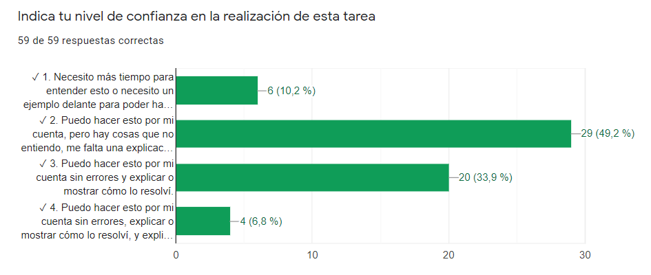

---
title-slide-attributes:
- data-background-image: /assets/intro.jpg
- data-background-size: cover
- data-background-opacity: 0.18
- data-background-color: aquamarine
title: En busca de la coherencia metodológica en la educación de emergencia 
subtitle: A través de la resolución de problemas en matemáticas
author: <a href="www.tierradenumeros.com">Pablo Beltrán-Pellicer¹ ² </a> & <a href=""> Ana Isabel Martínez Pérez¹</a>   ¹CPI Val de la Atalaya (María de Huerva, Zaragoza), ²Universidad de Zaragoza   Jornada Pensadero - Fundación Promaestro    24 de octubre de 2020       <a href="https://pbeltran.github.io/2020pensadero">https://pbeltran.github.io/2020pensadero</a>    
rollingLinks: true
description: Materiales distribuidos bajo licencia CC-BY-SA-4.0 

---

# Introducción {data-background-image="assets/intro.jpg" data-background-opacity="0.18"}

## ¿Qué es enseñar a través de la resolución de problemas? {data-background-image="assets/clase.jpg" data-background-opacity="0.12"}
:::::::::::::: {.columns}

::: {.column width="25%"}

{width=100%}

:::

::: {.column width="70%"}

- Sintetizando mucho, este enfoque consiste en utilizar problemas (en sentido amplio, tareas o situaciones-problema) para que emerja el contenido matemático. 
- Mediante el trabajo en pequeños grupos y las posteriores puestas en común, el docente proporciona un andamiaje para profundizar en dichos contenidos, siempre a partir de los significados personales de los alumnos.

:::

::::::::::::::

## ¿Qué es enseñar a través de la resolución de problemas? {data-background-image="assets/clase.jpg" data-background-opacity="0.12"}

:::::::::::::: {.columns}

::: {.column width="45%"}

{width=100%}

:::

::: {.column width="45%"}

{width=100%}

:::

::::::::::::::

## Nuestra preocupación y la estrategia seguida

> ¿Cómo mantener activo al alumnado? ¿Cómo seguir trabajando la capacidad de indagación? ¿Cómo seguir desarrollando esa **actitud matemática**?

- Agrupación por nivel. 
	- Una clase virtual para todo 1º ESO y otra clase virtual para todo 2º ESO.
	- Oportunidad para la codocencia.

## Nuestra preocupación y la estrategia seguida

- Una videoconferencia conjunta para planificar una semana de trabajo y otra para discutir las producciones que habían enviado los alumnos y preparar la puesta en común.
- Puestas en común: se reservaron los jueves como día para una videoconferencia donde se interactuaba con los alumnos. 
- Tareas semanales y autoevaluaciones. Después de cada videoconferencia, los alumnos hacían reentrega final de lo ya hecho, y recibían nuevas tareas, entre ellas, completar la autoevaluación. 

# Criterios de observación

## Producciones del alumnado

{width=100%}

## Atención a la diversidad

En una de las actividades, se trata de averiguar el circuncentro de algunos cuadriláteros: cuadrado, rectángulo, trapecio isósceles, trapecio rectángulo.

El del trapecio rectángulo no se puede hacer, claro, si trazas las mediatrices no se cortan en el mismo punto. 
Una alumna realizó la siguiente observación:

{width=80%}

## Atención a la diversidad

En clase presencial puedes animar a los alumnos a realizar este tipo de observaciones, eligiendo bien las preguntas. Por eso nos alegramos de ver esto en formato online. Le preguntamos que cómo podía estar segura de lo que decía y que se animara a utilizar las herramientas de geogebra.

{width=50%}

Después, le propusimos pensar acerca del porqué de que ocurra, que implica propiedades de la mediatriz y de ángulos, así como aspectos de perpendicularidad y semejanza.

## Las autoevaluaciones, el eje de la práctica

1. Necesito más tiempo para entender esto o necesito un ejemplo delante para poder hacerlo
2. Puedo hacer esto por mi cuenta, pero hay cosas que no entiendo, me falta una explicación y/o estoy cometiendo errores de cálculo.
3. Puedo hacer esto por mi cuenta sin errores y explicar o mostrar cómo lo resolví.
4. Puedo hacer esto por mi cuenta sin errores, explicar o mostrar cómo lo resolví, y explicar qué significa mi solución o hacer alguna observación adicional. 

> Además, tenían que escribir un párrafo donde describían sus dificultades; otro con lo que aprendieron; otro con lo que les gustaría aprender. La autoevaluación tenía que estar completa, si no se devolvía al alumno. 

## Autoevaluaciones: percepción del alumnado

> Esto son dos ejemplos de autoevaluación.

:::::::::::::: {.columns}

::: {.column width="45%"}

{width=100%}

Tarea: Escaleras, super figuras y formas por formas

:::

::: {.column width="45%"}

{width=100%}

Tarea: Pero...¿qué es un cuadrado? (sobre definiciones)

:::

::::::::::::::

## Autoevaluaciones: dificultades

{width=100%}

## Autoevaluaciones: ¿qué he aprendido?

{width=100%}

## Autoevaluaciones: ¿Qué me gustaría aprender? 

{width=100%}

# Retos y dificultades

## Retos y dificultades

- Menor interacción.
- Atención a la diversidad. 
- Pérdida de control del grado de ayuda que reciben en casa.

{width=80%}

# Procesos de validación e impacto educativo generado

## Niveles de interacción ahora

> Queda pendiente analizar el impacto educativo. Hasta ahora, la percepción es que este alumnado interactúa y presenta una actitud más proactiva ahora que a principios del curso pasado. 

- Ahora es imposible trabajar en mesas enfrentadas y/o agrupadas, por lo que hay que interactuar a distancia. 
- Parejas o grupos de cuatro alumnos, tal y como están sentados habitualmente.
- Ayuda de una pizarrita blanca para enseñar lo que se está haciendo.

# Créditos y referencias {data-background-image="assets/credits.jpg" data-background-opacity="0.1"}

## Lista de referencias {data-background-image="assets/credits.jpg" data-background-opacity="0.1"}

Cai, J. (2003). What research tells us about teaching mathematics through problem solving. Research and issues in teaching mathematics through problem solving, 241-254.

English, L. D., & Gainsburg, J. (2016). Problem Solving in a 21st-Century Mathematics Curriculum. En L.D. English, & D. Kirshner, _Handbook of international research in mathematics education_ (p. 326). New York: Routledge.

## {data-background-image="assets/credits.jpg" data-background-opacity="0.1"}

Gaulin, C. (2001). Tendencias actuales de la resolución de problemas. _Sigma, 19_, 51-63. [Enlace](http://www.hezkuntza.ejgv.euskadi.eus/r43-573/es/contenidos/informacion/dia6_sigma/es_sigma/adjuntos/sigma_19/7_Tendencias_Actuales.pdf)

## Créditos {data-background-image="assets/credits.jpg" data-background-opacity="0.1"}

_Compartir el conocimiento de forma libre es una buena práctica._

En estas diapositivas se han utilizado materiales disponibles en abierto y se han citado las fuentes correspondientes. El contenido de la presentación está publicado con licencia Creative Common [CC-BY-SA-4.0](https://creativecommons.org/licenses/by-sa/4.0/legalcode.es), lo que quiere decir que puedes compartirla y adaptarla, citándonos (Pablo Beltrán-Pellicer y Ana Isabel Martínez Pérez) y poniendo un enlace a la presentación.

_Siéntete libre de trabajar con este material y de contactar con nosotros para compartir tus reflexiones._

## {data-background-image="assets/credits.jpg" data-background-opacity="0.1"}

Presentación realizada con  <a href="https://revealjs.com/#/">Reveal.js</a>, <a href="https://pandoc.org/">Pandoc</a>, <a href="https://www.mathjax.org/">MathJax</a> y <a href="https://www.markdownguide.org/">Markdown</a>. El código fuente está disponible en [https://github.com/pbeltran](https://github.com/pbeltran/)

La fuente de las imágenes es propia, salvo las que se ha citado la fuente en su diapositiva y las de dominio público obtenidas en [Unsplash](https://unsplash.com).

